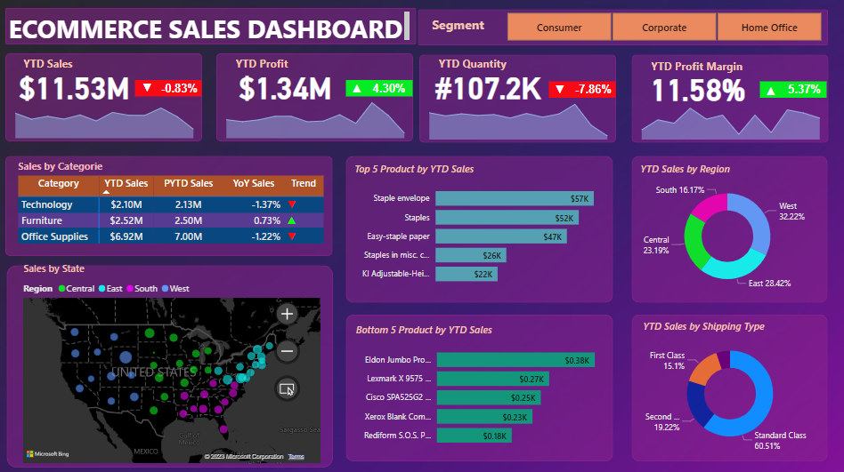

# PowerBI_ECommerce

In this project, I created a Power BI dashboard for US E-commerce data. The dashboard shows several YTD Profit and Sales numbers as well as visualisations in the form of maps, pie charts and tables. The data has been cleaned using SQL. There are several slicer options available on the dashboard.

*Tools: PowerBI, SQL, Data Cleaning*

